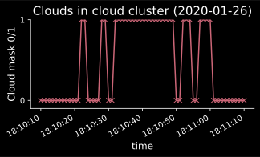

Identifying clouds and clusters of clouds in the ATR dataset
============================================================

Cloud indentification
---------------------

In the whole cloud composite dataset, many differnt cloud types can be found.
Thus it might make sense to take a look on individual cloud.
Therefore a script is implemented to identify individual clouds in the cloud composite dataset (data\observation\cloud_composite\processed\cloud_composite.nc)

Below you can find a copy of this script.
The important lines are highlighted.

.. note::
    - In lines ``162-165`` the script uses the ``cloud_mask`` to identify individual clouds.
    - In lines ``193-198`` the mid time of a cloud event is chosen as the leading dimension of the new netCDF file.
    - The leading dimension becomes ``time``.

.. literalinclude:: ../../scripts/preprocessing/cloud_identification_general.py
    :language: python
    :linenos:
    :emphasize-lines: 162-165, 193-198

Cloud cluster identification
----------------------------

**Problem**

Because the ATR often flew through clouds with less droplets, the ``cloud_mask`` and ``rain_mask`` have "holes" along the time dimension.
Here is an example image which shows an example cloud clusters in the ATR dataset.
Each one of the spikes will be identified as an individual cloud by the script shown above.
The script below ignores holes between the clouds if they do not exceed a specified duration.

**Script**

The script below is used to identify cloud clusters in the ATR dataset.
It is very similar to the cloud identification script.

.. note::
    - The main differnce lies in lines ``161-174``.
    - Here a ``cluster_mask`` is created, by removing the cloud holes which are shorter than a specified time span.
    - For this procedure, the funciton ``sdm_eurec4a.identification.consecutive_events_xr`` is used. For more information see the API documentation of this function. You can use the search function at the top right to find it.

.. literalinclude:: ../../scripts/preprocessing/cluster_identification_general.py
    :language: python
    :linenos:
    :emphasize-lines: 161-174

