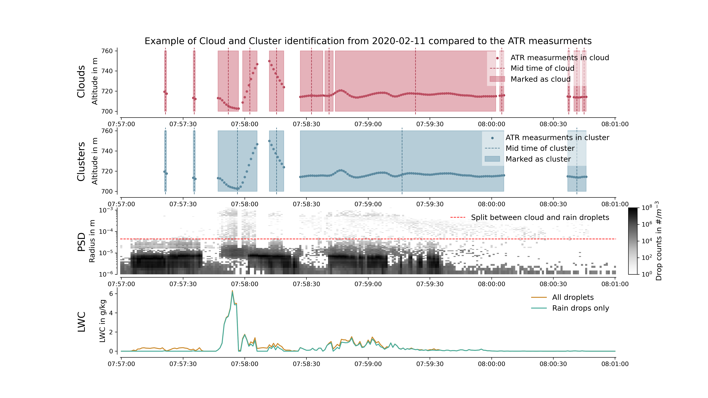

.. _cloud_and_cluster_identification:

Identifying clouds and clusters of clouds in the ATR dataset
============================================================

Cloud indentification
---------------------

In the whole cloud composite dataset, many differnt cloud types can be found.
Thus it might make sense to take a look on individual cloud.
Therefore a script is implemented to identify individual clouds in the cloud composite dataset ``data/observation/cloud_composite/processed/cloud_composite.nc``.
To obtain this see also :ref:`data_preprocessing`

*Script*

The dataset containing the identified clouds looks like this:

.. code-block:: python

    <xarray.Dataset>
    Dimensions:               (time: 493)
    Coordinates:
        cloud_id              (time) int64 0 1 2 3 4 5 ... 1030 1031 1032 1033 1042
    * time                  (time) datetime64[ns] 2020-01-25T14:43:58.500000 .....
    Data variables:
        start                 (time) datetime64[ns] 2020-01-25T14:43:58 ... 2020-...
        end                   (time) datetime64[ns] 2020-01-25T14:43:59 ... 2020-...
        duration              (time) timedelta64[ns] 00:00:01 00:00:01 ... 00:00:02
        mid_time              (time) datetime64[ns] 2020-01-25T14:43:58.500000 .....
        alt                   (time) float64 682.0 682.1 681.7 ... 858.4 599.6 303.2
        lat                   (time) float64 12.87 12.86 12.82 ... 12.91 12.87 12.84
        lon                   (time) float64 -58.23 -58.23 -58.23 ... -57.75 -57.75
        horizontal_extent     (time) float64 99.06 99.27 2.098e+03 ... 102.6 185.9
        vertical_extent       (time) float64 0.1431 0.09625 3.693 ... 0.69 1.32
        liquid_water_content  (time) float64 0.2004 0.3044 9.811 ... 0.02697 0.01847
    Attributes:
        description:    cloud identification dataset
        creation_time:  2024-02-12 11:33:00.260176
        details:        Cloud identification is done by using the rain_mask from ...
        author:         Nils Niebaum
        email:          nils-ole.niebaum@mpimet.mpg.de
        institution:    Max Planck Institute for Meteorology

.. note::
    - The input data is the cloud composite dataset.
    - The main idea behind it is to use a boolean mask (e.g. the pre-defined ``cloud_mask``) to identify individual clouds.
    - Using the ``xarray.diff`` function along the time dimension, the changes in the ``cloud_mask`` are identified.
    - These differences show the switch from e.g. cloud to non cloud sections in the dataset and vice versa.
    - Thus the start and end time stamps of individual clouds can be obtained.
    - In lines ``162-165`` the script uses the user defined boolean mask, to identify these individual clouds.
    - In lines ``193-198`` the mid time of a cloud event is chosen as the leading dimension of the new netCDF file.
    - The leading dimension becomes ``time``.

.. literalinclude:: ../../scripts/preprocessing/cloud_identification_general.py
    :language: python
    :linenos:
    :emphasize-lines: 162-165, 193-198

Cloud cluster identification
----------------------------

Because the ATR often flew through clouds with less droplets, the ``cloud_mask`` and ``rain_mask`` have "holes" along the time dimension.
Here is an example image which shows an example cloud clusters in the ATR dataset.
Each one of the spikes will be identified as an individual cloud by the script shown above.
The script below ignores holes between the clouds if they do not exceed a specified duration.

*Script*

.. note::
    - The script below is used to identify cloud clusters in the ATR dataset.
    - It is very similar to the cloud identification script mentioned above.
    - The main differnce lies in lines ``161-174``.
    - Here a ``cluster_mask`` is created based on the user defined boolean mask.
    - This is done by *removing* all cloud holes which are shorter than a specified time span (``min_duration_cloud_holes``)
    - The results of this can be seen in the figure above. For the cluster identification, small individual clouds are combined into longer durating clusters.
    - For this procedure, the function :py:func:`sdm\_eurec4a.identification.consecutive\_events\_xr` is used. For more information see the API documentation of this function. You can use the search function at the top right to find it.

The dataset created by the script which used the pre-defined ``rain_mask`` and with ``min_duration_cloud_holes = 5`` looks like this:

.. code-block:: python

    <xarray.Dataset>
    Dimensions:               (time: 189)
    Coordinates:
        cloud_id              (time) int64 0 1 2 3 4 5 6 ... 374 375 378 379 380 381
    * time                  (time) datetime64[ns] 2020-01-25T14:44:00.500000 .....
    Data variables:
        start                 (time) datetime64[ns] 2020-01-25T14:43:58 ... 2020-...
        end                   (time) datetime64[ns] 2020-01-25T14:44:03 ... 2020-...
        duration              (time) timedelta64[ns] 00:00:05 00:00:21 ... 00:00:01
        mid_time              (time) datetime64[ns] 2020-01-25T14:44:00.500000 .....
        alt                   (time) float64 682.0 681.7 679.6 ... 860.5 858.4 599.6
        lat                   (time) float64 12.86 12.82 12.79 ... 12.69 12.91 12.87
        lon                   (time) float64 -58.23 -58.23 -58.22 ... -58.38 -57.75
        horizontal_extent     (time) float64 495.6 2.098e+03 ... 91.77 102.6
        vertical_extent       (time) float64 0.369 3.693 11.45 ... 5.51 0.04004 0.69
        liquid_water_content  (time) float64 0.8522 9.811 9.226 ... 0.02483 0.02697
    Attributes:
        description:    cloud identification dataset
        creation_time:  2024-02-12 11:56:57.777145
        details:        Cloud identification is done by using the cluster_rain_ma...
        author:         Nils Niebaum
        email:          nils-ole.niebaum@mpimet.mpg.de
        institution:    Max Planck Institute for Meteorology

.. literalinclude:: ../../scripts/preprocessing/cluster_identification_general.py
    :language: python
    :linenos:
    :emphasize-lines: 161-174
